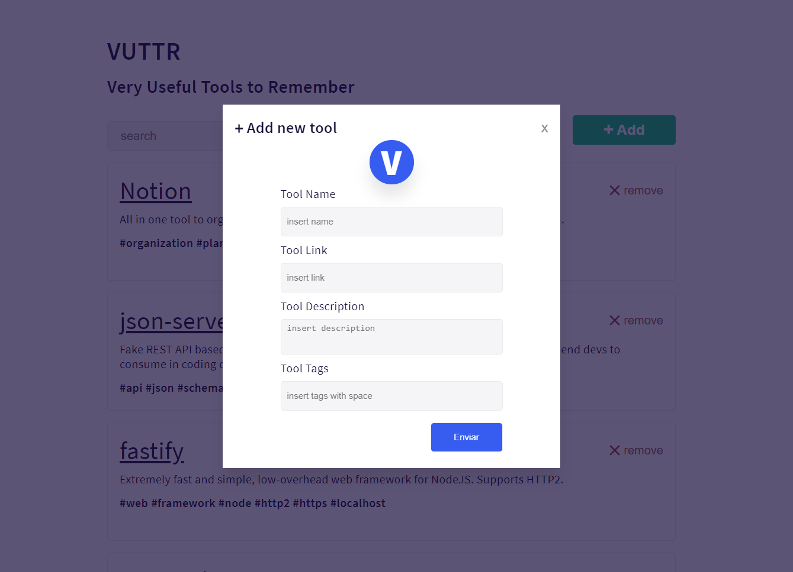

# VUTTR - Very Useful Tools to Remember 🔨 

## Rodando o projeto

> Baixe ou clone este repositório.

> Acesse a raiz do projeto por um console e execute:

- `yarn add ou npm i` para instalar as dependências do projeto
- `yarn start ou npm start` para rodar a aplicação

## Imagens: 📷

### <strong>Home:</strong>

### <strong>Adicionar ferramenta:</strong>

## Sobre o projeto: 📃

Construir um front-end para a aplicação VUTTR (Very Useful Tools to Remember). A aplicação é um simples repositório para gerenciar ferramentas com seus respectivos nomes, links, descrições e tags.

## Requisitos do projeto: ✅
* Home - Página com uma lista de todas as ferramentas cadastradas.
* Um modal para poder adicionar uma nova ferramenta.
* Um modal para poder remover uma ferramenta.
* O usuário poder buscar ferramentas dinamicamente (global ou utilizando apenas tags).

## Frameworks e Tecnologias Utilizadas: 🌌
### Front-End: 🎨

* <strong>React.js</strong> (Criação da Interface)
* <strong>Styled Components</strong> (Estilização)
* <strong>Axios</strong> (Requisições a API)
* <strong>Toastify</strong> (Notificações na tela)

## Backend: 💾
* <strong>API que lista todas as ferramentas cadastradas</strong>